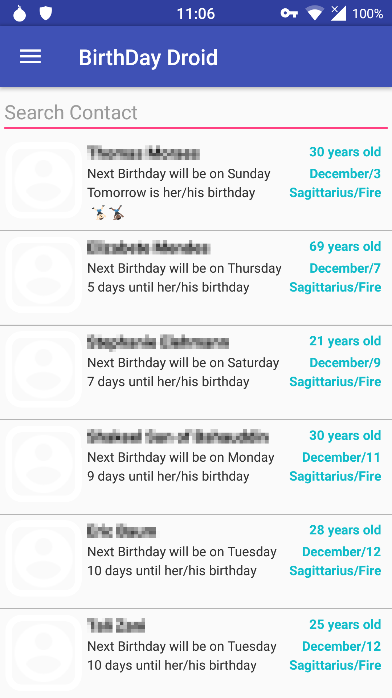
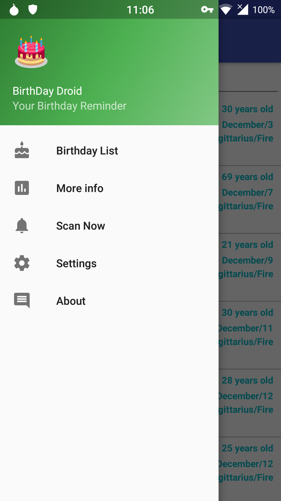
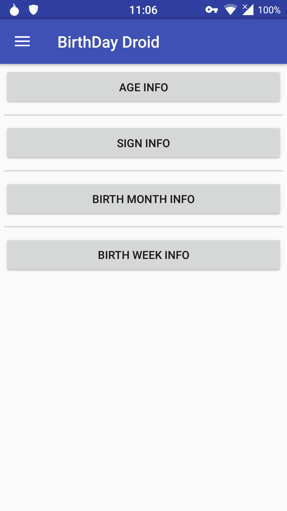
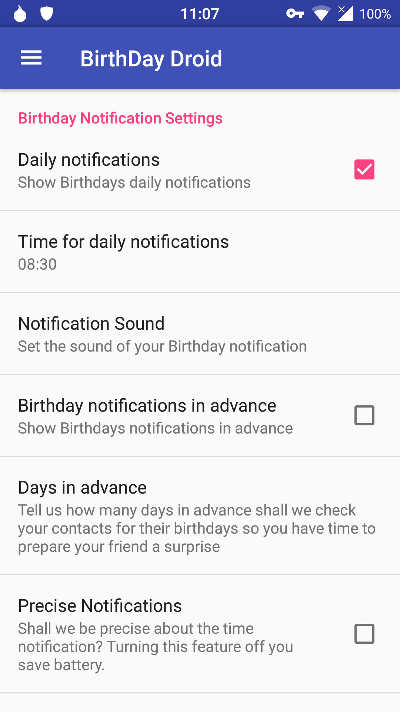
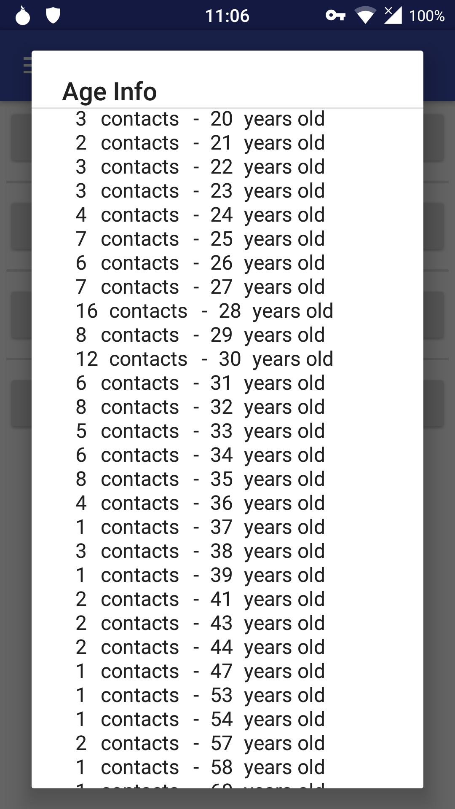
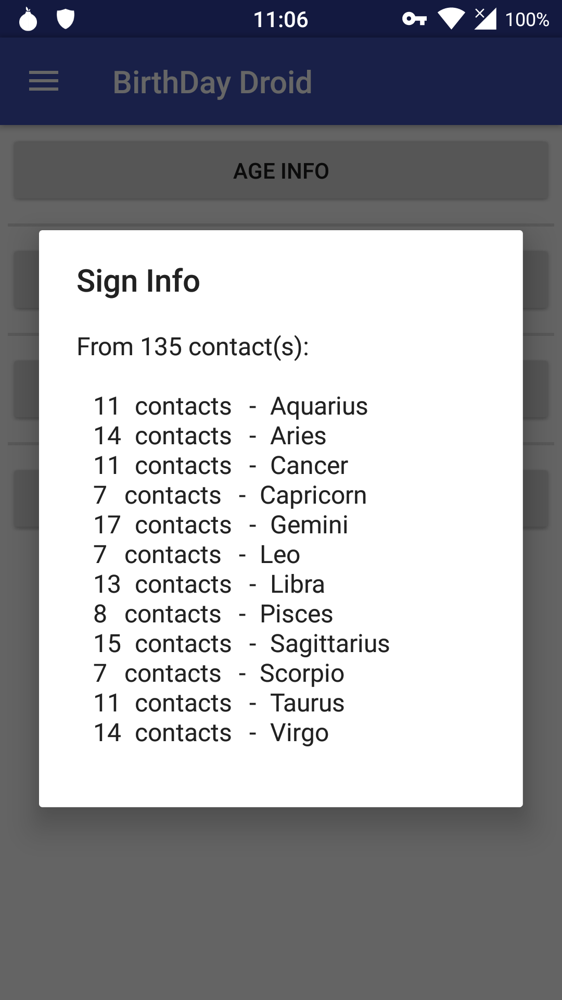

# BirthDayDroid

#### Basic information

BirthDayDroid is a simple Android application to help you to remember your
contact's birthdays. It scans your local contact list looking for birthdays.
When it finds it, it will show you the contact's age, sign, days until
her/his birthday.

#### What is done

  * Birthday daily notifications
  * Birthday notifications in advance
  * Show age/sign/days until next birthday/week day from each contact
  * Ordering list by age/days until/name/sign
  * Some other infos

#### Screenshots

#### Where can I find it?

#### Help us buying us a coffee \o/

[Check BirthdayDroid webpage if you want to help us :)](https://tmendes.gitlab.io/BirthDayDroid/)
 

#### Contact

For any question, bug report, suggestion please drop us a line

#### Translate

If you want to help us to translate this app to your language go to: <a href="https://transifex.com/wlnomads/birthdaydroid/">https://transifex.com/wlnomads/birthdaydroid</a>

#### The BirthDayDroid Project Team

##### Project Manager

Thiago Ribeiro Mendes

##### Developers

Thiago Ribeiro Mendes 

##### Special thanks

Emoji provided free by [Emoji One](http://emojione.com/)

Bitcon Icon made by [freepik](https://www.flaticon.com/authors/freepik) from www.flaticon.com

# License

    Copyright 2015-2016 The BirthDayDroid Project Team

    This program is free software; you can redistribute it and/or
    modify it under the terms of the GNU General Public License
    as published by the Free Software Foundation; either version 3
    of the License, or (at your option) any later version.

    https://www.gnu.org/licenses/gpl-3.0.html

    This program is distributed in the hope that it will be useful,
    but WITHOUT ANY WARRANTY; without even the implied warranty of
    MERCHANTABILITY or FITNESS FOR A PARTICULAR PURPOSE.  See the
    GNU General Public License for more details.

    You should have received a copy of the GNU General Public License
    along with this program.  If not, see <http://www.gnu.org/licenses/>.

